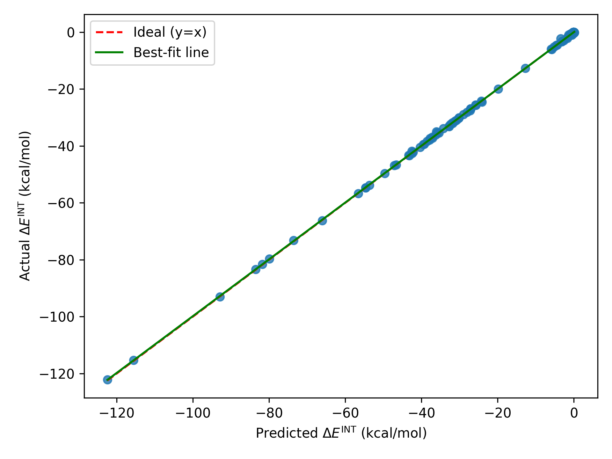

# UEDDIE-ML
Unified EDDIE-ML, or UEDDIE-ML (pronounced "oodie-ML"), is a transformer model that predicts interaction energies from atomistic deformation density coefficients for both neutral and charged systems, based on Dr. Kaycee Low's original EDDIE-ML. The main innovation is the introduction of a charge scaling factor to scale atomistic contributions in the atomistic approximation based on monomer charge. This produces test metrics less than 1 kcal/mol, thereby reaching chemical accuracy statistically. 

## Overview
This repository implements the following scientific computing and machine learning pipeline:
1. Deformation densities are calculated using (GPU4)PySCF and stored as .cube files
2. Those .cube files, encoding uniform deformation density grids, are read and atomistic descriptors are calculated from them and stored as .coeff files
3. The dataset is created and dimensionality reduction (PCA) is applied to form the features, creating `output.hdf5`
4. Interaction energies are calculated (in Hartrees) using the CPU-based open-source quantum chemistry engine Psi4, creating `energies.dat`
5. The atomistic machine learning model UEDDIE-ML is trained and tested using a roughly 80/20 split  by default of the dataset and interaction energies 

## Requirements
- `get_deformation_densities.py` requires `numpy` and `pyscf`, and optionally but recommended `gpu4pyscf` 
- `get_dens_coeffs.py` requires `numpy`, `ase`, `scipy`, `spherical_functions`, `sympy`, and `h5py`
- `make_dataset.py` requires `numpy`, `h5py`, `matplotlib`, and `scikit-learn`
- `get_energies.py` requires Psi4 and the `psi4` Python package
- `train.py` requires `numpy`, `h5py`, `scikit-learn`, `joblib`, `torch`, `matplotlib`, and 'seaborn' 

You may need different environments to run each script, because oftentimes Psi4, PySCF, and PyTorch conflict, especially in a HPC module environment.
